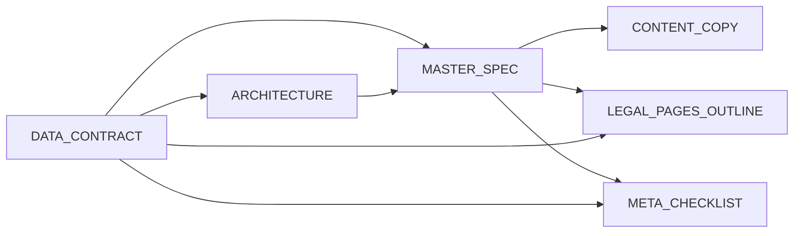

# IE ABISHEV — verification landing

Corporate landing for **IE ABISHEV** (automotive repair and maintenance, **OKED 45201**). The **Next.js app** lives in this repo alongside **[docs/IMPLEMENTATION_PHASE2.md](docs/IMPLEMENTATION_PHASE2.md)** and the rest of the documentation package.

## Infrastructure (VPS / DNS)

- [docs/INFRA_DNS.md](docs/INFRA_DNS.md) — Hetzner DNS zone **orderflowpvl.website** (template in `infra/dns/`)  
- [infra/dns/zone-reference.zone](infra/dns/zone-reference.zone) — zone snapshot  
- [infra/ssh/](infra/ssh/) — Windows SSH setup scripts (keys in `infra/ssh/secrets/`, gitignored)  
- [infra/deploy/deploy-vps.bat](infra/deploy/deploy-vps.bat) — manual deploy from Windows (`deploy-vps.ps1` + [infra/deploy/remote-deploy.sh](infra/deploy/remote-deploy.sh))  
- [.github/workflows/deploy-vps.yml](.github/workflows/deploy-vps.yml) — **auto deploy on push to `main`** (requires GitHub Secrets `VPS_HOST`, `VPS_USER`, `VPS_SSH_PRIVATE_KEY`; VPS must have repo cloned + PM2)

## Cursor: Talk to Figma MCP

- Config: [`.cursor/mcp.json`](.cursor/mcp.json) (`npx cursor-talk-to-figma-mcp@latest`)  
- Steps: [docs/FIGMA_MCP_SETUP.md](docs/FIGMA_MCP_SETUP.md)

## Documentation index

Read in this order for onboarding:

| # | Document | Purpose |
|---|----------|---------|
| 1 | [docs/DATA_CONTRACT.md](docs/DATA_CONTRACT.md) | Canonical IIN, address, contacts, Meta field mapping, **`BUSINESS_INFO` TypeScript shape** |
| 2 | [docs/ARCHITECTURE.md](docs/ARCHITECTURE.md) | **Canonical file map**, section order, Technology mandatory, resolved naming conflicts |
| 3 | [docs/MASTER_SPEC.md](docs/MASTER_SPEC.md) | Stack, design system, page structure, routing (file map → ARCHITECTURE) |
| 4 | [docs/CONTENT_COPY.md](docs/CONTENT_COPY.md) | English marketing and UI strings |
| 5 | [docs/CONTENT_GUIDELINES.md](docs/CONTENT_GUIDELINES.md) | Footer language, identity display rules |
| 6 | [docs/LEGAL_PAGES_OUTLINE.md](docs/LEGAL_PAGES_OUTLINE.md) | Privacy / terms **structure** |
| 7 | [docs/LEGAL_COPYWRITING.md](docs/LEGAL_COPYWRITING.md) | Required legal phrases and drafting notes |
| 8 | [docs/META_CHECKLIST.md](docs/META_CHECKLIST.md) | Pre-submit checks (site, email, PDFs, Meta form) |
| 9 | [docs/IMPLEMENTATION_PHASE2.md](docs/IMPLEMENTATION_PHASE2.md) | `create-next-app`, dependencies, commit order, deploy |

**Alias:** [docs/META_SUBMISSION_CHECKLIST.md](docs/META_SUBMISSION_CHECKLIST.md) → points to `META_CHECKLIST.md`.

## Document dependencies



## Cursor / AI rules

| Location | Use |
|----------|-----|
| [`.cursorrules`](.cursorrules) | Root rules (widely loaded by agents) |
| [`.cursor/rules/ie-abishev-landing.mdc`](.cursor/rules/ie-abishev-landing.mdc) | Scoped project rules (`globs`, optional `alwaysApply`) |

Enable or @-mention the rule file in Cursor per your workflow so codegen follows **`DATA_CONTRACT.md`** and **`ARCHITECTURE.md`**.

## Next step (implementation)

1. Follow [docs/IMPLEMENTATION_PHASE2.md](docs/IMPLEMENTATION_PHASE2.md) to scaffold Next.js.  
2. Implement `lib/config/business.ts` from [docs/DATA_CONTRACT.md](docs/DATA_CONTRACT.md).  
3. Build UI per [docs/ARCHITECTURE.md](docs/ARCHITECTURE.md), [docs/MASTER_SPEC.md](docs/MASTER_SPEC.md), [docs/CONTENT_COPY.md](docs/CONTENT_COPY.md).  
4. Legal pages per [docs/LEGAL_PAGES_OUTLINE.md](docs/LEGAL_PAGES_OUTLINE.md) and [docs/LEGAL_COPYWRITING.md](docs/LEGAL_COPYWRITING.md).  
5. Run [docs/META_CHECKLIST.md](docs/META_CHECKLIST.md) on production.

## Local dev

```bash
npm install
npm run dev
```

Open [http://localhost:3000](http://localhost:3000). Production build: `npm run build` then `npm start`.

**Note:** The parent folder name may contain non-ASCII characters; `package.json` **`name`** is set to `ie-abishev-landing` so npm commands work normally.
